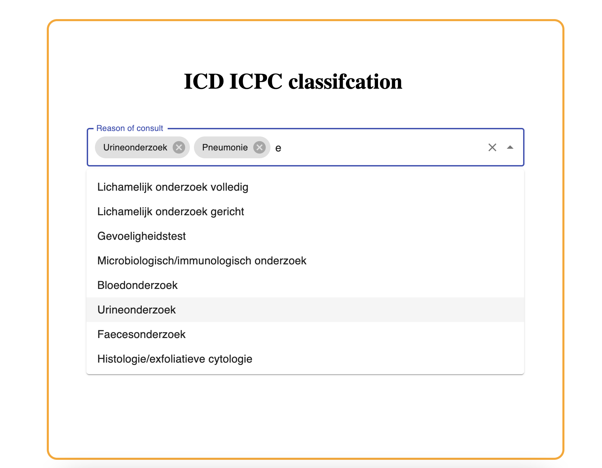

# ICD/ICPC Searchbar



## ICD
"For more than a century, the International Classification of Diseases (ICD) has been the basis for comparable statistics on causes of mortality and morbidity between places and over time. ICD serves a broad range of uses globally and provides critical knowledge on the extent, causes and consequences of human disease and death worldwide via data that is reported and coded with the ICD. Clinical terms coded with ICD are the main basis for health recording and statistics on disease in primary, secondary and tertiary care, as well as on cause of death certificates. These data and statistics support payment systems, service planning, administration of quality and safety, and health services research. Diagnostic guidance linked to categories of ICD also standardizes data collection and enables large scale research."

[Source](https://www.who.int/standards/classifications/classification-of-diseases)

## ICPC
"ICPC (International Classification of Primary Care) classifies patient data and clinical activity in the domains of General/Family Practice and primary care, taking into account the frequency distribution of problems seen in these domains. It allows classification of the patient’s reason for encounter (RFE), the problems/diagnosis managed, interventions, and the ordering of these data in an episode of care structure."

[Source](https://www.who.int/standards/classifications/other-classifications/international-classification-of-primary-care)

## Installation
Clone repository
```bash
git clone https://github.com/KelvinKramp/ICPC-ICD-React-python.git
```

### Change configuration
In ba/icpc.py change url to your pdf with an ICD/ICPC or other classification. The current one is a Dutch version used in primary care, but there are more languages online.  

### Start backend server
Install python and pip and follow the following steps:
```bash
cd ICPC-ICD-React-python/ba
source venv/bin/activate
pip install -r requirements.txt
python3 api.py
```

### Start frontend 
Install react, yarn, material ui and start yarn in main directory:

```bash
npm install @mui/material @emotion/react @emotion/styled
yarn add @material-ui/lab
yarn add @material-ui/core
yarn start
```

## Goals
- More effient and accurate registration of reasons of encounter.  


## To do
- Include selection of attending physician.
- Extent the title of items to code + name. 
- Add buttons EPD + EVS.
- Add department info. 
- Add patient info.
- Group the options based on code (https://mui.com/material-ui/react-autocomplete/).
- Remove irrelevant codes for specified population.
- If "not in list", let creatable box popup.  

